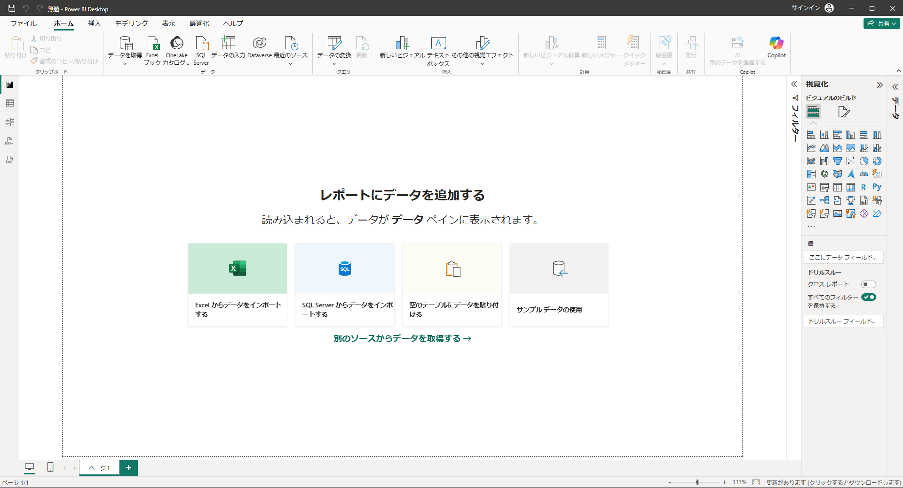
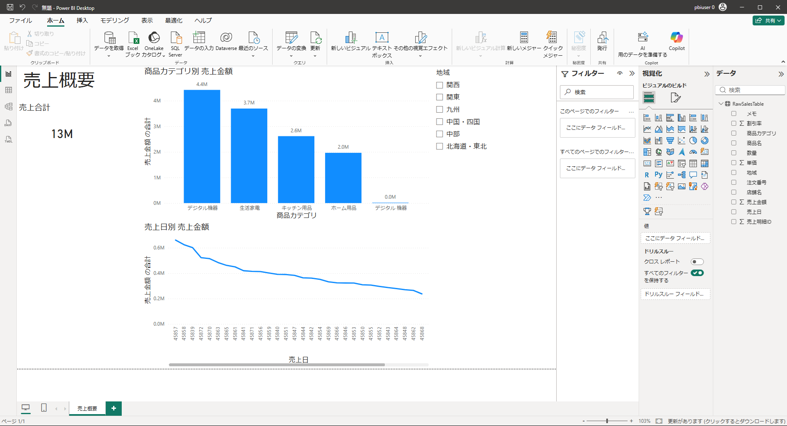

# 演習01 Excelから最初のレポートを作成

## 演習概要

Excelの売上データをPower BI Desktopへ読み込み、1ページの「売上概要」レポートを作成します。カード、集合縦棒グラフ、折れ線グラフ、スライサーを組み合わせ、「主要指標・比較・推移・条件指定」を1画面で確認します。

## 到達目標

- Power BI Desktopのレポートビューと主要なペインを確認できる
- Excelテーブルをセマンティックモデルへ読み込める
- 目的に応じてカード、棒グラフ、折れ線グラフ、スライサーを使い分けられる
- フィールドの配置場所と集計方法を確認できる
- スライサーによる複数ビジュアルの連動を確認できる
- PBIXファイルを指定した名前で保存できる

## 所要時間

30分

## 作成するレポート

| 確認したいこと | 使用するビジュアル | 表示内容 |
|---|---|---|
| 売上はいくらか | カード | 売上金額の合計 |
| どの商品カテゴリの売上が大きいか | 集合縦棒グラフ | 商品カテゴリ別売上 |
| 売上は日ごとにどう変化したか | 折れ線グラフ | 売上日別売上 |
| 地域を限定すると結果はどう変わるか | スライサー | 地域による絞り込み |

ページ名とページタイトルは「売上概要」、PBIX名は `PowerBI演習01_最初のレポート.pbix` とします。

> **実務上の注意**
>
> 実務では、レポートを作り始める前に、利用者と業務上の判断目的を明確にします。
> 継続して更新するレポートでは、個人PCだけに依存しないデータの保管場所と更新担当を決めておくことも重要です。

## 手順

### 1. Power BI Desktopの画面を確認する

1. Power BI Desktopを起動します。

2. ウィンドウ右上に表示される[サインイン]をクリックして、以下の情報を用いてサインインします。

   | 項目       | 値                                                           |
   | ---------- | ------------------------------------------------------------ |
   | メール     | **PBIUser##@ctctedu.onmicrosoft.com** ※##の部分は仮想マシンと同じ数字に置き換えてください |
   | パスワード | **講師より配布された演習用仮想マシンのパスワードと同一**     |

3. スタート画面が表示された場合は、［空のレポート］を選択します。

4. 左側の縦メニューで、棒グラフのようなアイコンの［レポート ビュー］を選択します。

5. 中央に白いキャンバス、右側に［フィルター］、［視覚化］、［データ］のペインがあることを確認します。

### 2. Excelテーブルを読み込む

1. ［ホーム］リボンメニューからデータセクションの［Excelブック］を選択します。

   > 新しいエクスペリエンスに関するポップアップが表示された場合は［いいえ］を選択します。

2. エクスプローラーにて `Windows(C:)`→` PowerBITraining` →`Excel`の順にフォルダーを開き、`売上データ_加工前.xlsx`を選択します。

3. ［ナビゲーター］の左側で、テーブルアイコンが付いた`RawSalesTable`のチェックボックスをオンにします。

4. シートアイコンの`売上データ`は選択しません。こちらは演習02で使用します。

5. プレビューに`売上日`、`地域`、`商品カテゴリ`、`売上金額`などの列があることを確認します。

6. ［読み込み］を選択し、レポート画面へ戻るまで待ちます。

8. ［データ］ペインに`RawSalesTable`が表示されたことを確認します。

### 3. ページ名とタイトルを設定する

1. 画面下部の`ページ 1`をダブルクリックし、`売上概要`へ変更します。
2. 編集できない場合は、ページタブを右クリックして［名前の変更］を選択します。
3. リボンメニューを［挿入］に切り替え、［テキスト ボックス］を選択します。
4. フォントサイズを32ポイント程度に変更後、`売上概要`と入力してページ左上に配置します。

### 4. 最初のビジュアルとして売上合計カードを作る

1. キャンバスの白い場所を選択します。

2. ［視覚化］ペインで、四角形の中に数値が表示された［カード］を選択します。

   > カードビジュアルは2種類存在します。今回使用するカードは稲妻アイコンが付与されていないものとなります。
   >
   > デフォルトで表示されていない場合はビジュアル一覧の最下部にある三点リーダ（・・・）をクリックし、[既定の視覚化の復元]を実行します。

3. ［データ］ペインで`RawSalesTable`を展開します。

4. 列項目の`売上金額`を、視覚化ペインにあるカードの［フィールド］へドラッグします。

5. フィールド欄の`売上金額`のメニュー（下向きの三角）を開き、集計が［合計］であることを確認します。

6. 視覚化ペイン内のグラフと筆が重なったアイコン［ビジュアルの書式設定］を選択し、［全般］→［タイトル］をオンにします。

7. タイトルを展開して`売上合計`をテキスト欄に入力します。

8. タイトルと重複するため、書式設定の[ビジュアル]タブで[カテゴリ ラベル] をオフにします。

9. カードをページ上部の左側へ移動し、テキストボックスの下に配置します。

> **画面確認**
>
> カードには売上金額の合計が1つの大きな数値で表示され、タイトルは「売上合計」になっています。

### 5. ビジュアル作成の共通操作を確認する

これ以降のビジュアルは、次の流れで作成します。

1. 既存ビジュアルの外側にある白い場所を選択します。

2. ［視覚化］ペインで作成するビジュアルを選択します。

3. ［データ］ペインから、表に示す軸・値・フィールドへ列をドラッグします。

4. 数値列の集計方法を確認します。

5. ［ビジュアルの書式設定］でタイトルなどを設定します。

   > 書式設定の項目は検索が可能です

6. 外枠をドラッグして移動し、右下のハンドルで大きさを調整します。

既存ビジュアルを選択したまま別の種類を選ぶと、選択中のビジュアルが置き換わります。新しく追加するときは、最初にキャンバスの白い場所を選択してください。

### 6. 残りのビジュアルを作成する

次の表を上から順に設定します。売上金額の集計はすべて［合計］です。

| ビジュアル | 表示目的 | フィールド配置 | タイトル | 主な表示設定 | 配置 |
|---|---|---|---|---|---|
| 集合縦棒グラフ | 商品カテゴリ間の比較 | X軸: `商品カテゴリ` / Y軸: `売上金額` | 商品カテゴリ別 売上金額 | データラベルをオン | 中央上 |
| 折れ線グラフ | 日ごとの推移 | X軸: `売上日` / Y軸: `売上金額` | 売上日別 売上金額 | 売上日が数値になることは無視します | 棒グラフの下 |
| スライサー | 地域による条件指定 | フィールド: `地域` | 地域 | 地域名が読める高さ | ページ右側 |

#### 加工前データの状態を確認する

商品カテゴリ別グラフには、似た名前のカテゴリが別々に表示される場合があります。これは加工前データの表記ゆれです。この演習では修正せず、後続の演習でPower Queryを使って整えます。売上日付が日付形式ではなく数値で表示される問題も同様に解消していきます。

### 7. スライサーによる連動を確認する

1. 地域スライサーで任意の地域を1つ選択します。
2. カードの売上合計、商品カテゴリ別の棒、売上日別の折れ線が変化することを確認します。
3. スライサー右上の消しゴム、または［選択のクリア］を選択します。
4. すべての地域を含む表示へ戻ったことを確認します。

スライサーは表示条件を一時的に変更します。元データが削除されたわけではありません。

### 8. 配置を整えて保存する

1. 上段にページタイトルとカード、中央左に棒グラフ、下段に折れ線グラフ、右側にスライサーを配置します。
2. ビジュアル同士が重ならず、タイトルと項目名が読めることを確認します。
3. ［ファイル］→［名前を付けて保存］を選択します。
4. 任意のフォルダに`PowerBI演習01_最初のレポート.pbix`として保存します。
5. タイトルバーに保存したファイル名が表示されたことを確認します。

## よくあるエラーと復旧

### 新しいビジュアルではなく、既存のビジュアルが変わった

Ctrl+Zで戻し、キャンバスの白い場所を選択してから、目的のビジュアルを選び直します。

### 売上金額が「カウント」になった

カードの［データ］またはグラフの［Y軸］にある`売上金額`のメニューを開き、［合計］を選択します。

### スライサーの選択を解除できない

スライサー右上の消しゴム、または［選択のクリア］を選択します。

## 追加課題

集合縦棒グラフを選択し、`地域`を［凡例］へ追加します。地域ごとの内訳を確認したら、凡例の`地域`を［×］で取り除いて元へ戻します。

## 次の演習への引継ぎ

演習02ではこのPBIXを別名保存し、ExcelワークシートをPower Queryで読み直します。表記ゆれ、欠損、型不整合などを再実行可能な手順として修正します。

[演習02へ進む](./02-transform-data-with-power-query.md)
