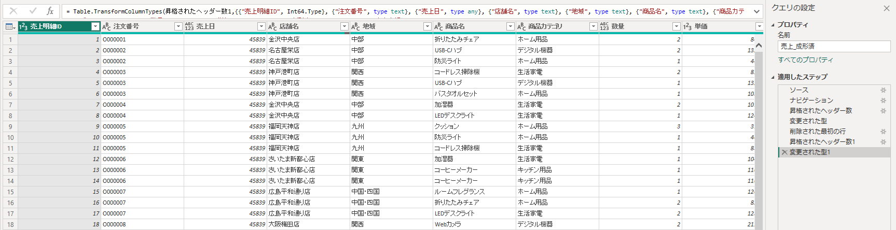

# 演習02 Power Queryでデータを整形

## 演習概要

演習01と同じExcelブックのワークシートをPower Queryで読み込み、説明行、不要列、表記ゆれ、欠損、異常値、型不整合、重複を順番に処理します。操作は［適用したステップ］へ記録され、元のExcelを書き換えずに再実行できます。

## 到達目標

- レポートビューからPower Queryエディターを開ける
- ワークシートとExcelテーブルを見分けて選択できる
- 不要な行列を削除し、先頭行をヘッダーとして使用できる
- フィルター、トリミング、値の置換を使ってデータを整形できる
- データ型、欠損、エラー、重複を確認して処理できる
- ［適用したステップ］で処理の順序を確認できる

## 所要時間

25分

## 完成イメージ

| 確認項目 | 完成状態 |
|---|---|
| クエリ名 | `売上_整形済` |
| 列数 | 11列（`メモ`列を削除） |
| 行数 | 716行 |
| 商品カテゴリ | 4種類 |
| データ型 | 日付、整数、10進数、テキストを設定 |
| 処理履歴 | ［適用したステップ］に記録 |

> **実務上の注意**
>
> 実務では、クエリ名や重要なステップ名を、後から見ても処理内容が分かる名称にします。
> ExcelやCSVでは自動判定だけに頼らず、日付、数値、コード列のデータ型とロケールも確認します。

## 手順

### 1. PBIXを別名保存してPower Queryを開く

1. ［ファイル］→［空のレポート］を選択します。
2. 新しく開いたレポートを`PowerBI演習02_PowerQuery.pbix`として保存します。
3. ［ホーム］→［データの変換］を選択します。
4. Power Queryエディターが別ウィンドウで開くまで待ちます。

### 2. 整形前のワークシートを読み込む

1. ［ホーム］→［新しいソース］→［Excelブック］を選択します。
2. `PowerBITraining/Excel/売上データ_加工前.xlsx`を開きます。
3. ［ナビゲーター］で、シートアイコンが付いた`売上データ`を選択します。
4. テーブルアイコンの`RawSalesTable`は選択しません。今回は説明行を含むワークシートを使用します。
5. プレビュー先頭にタイトルや説明文があることを確認し、［OK］を選択します。
6. 左側に追加されたクエリを右クリックして［名前の変更］を選び、`売上_整形済`とします。

### 3. データの開始位置とヘッダーを整える

1. `売上_整形済`が選択されていることを確認します。
2. ［ホーム］→［行の削除］→［上位の行の削除］を選択します。
3. 行数に`3`と入力して［OK］を選択します。
4. プレビューの先頭行に`売上明細ID`、`注文番号`、`売上日`などが並んだことを確認します。
5. リボンメニューを［変換］に切り替えて、［1行目をヘッダーとして使用］を選択します。
6. 列名が`Column2`などから、正しい項目名へ変わったことを確認します。
7. ［適用したステップ］に［削除された最初の行］と［昇格されたヘッダー数1］が追加されたことを確認します。

### 4. 最初の変換として商品カテゴリを統一する

1. `商品カテゴリ`の列見出しを選択します。
2. リボンメニューの［変換］から［書式］→［トリミング］を選択します。
3. 同じ列を選択したまま［変換］→［値の置換］を選択します。
4. ［検索する値］に`デジタル 機器`、［置換後］に`デジタル機器`を入力します。
5. ［OK］を選択します。
6. 列のフィルターボタンを開き、商品カテゴリが4種類になったことを確認します。
7. チェック状態を変更せず、フィルター外を選択して閉じます。

トリミングは文字列の前後にある空白を除きます。文字列の途中にある空白は除かないため、値の置換も使用します。

### 5. 残りの列処理を行う

列処理は、次の共通操作で行います。

1. 表の［対象列］にある列見出しを選択します。
2. ［操作］に示すメニューを開き、［設定値］を指定します。
3. 処理後に［適用したステップ］へ新しいステップが追加されたことを確認します。
4. ［操作後の確認］とプレビューを比較します。

次の表を上から順に実施します。

| 順序 | 対象列 | 操作 | 設定値 | 操作後の確認 |
|---:|---|---|---|---|
| 1 | `メモ` | 列見出しを右クリック→［削除］ | なし | 11列になる |
| 2 | `店舗名` | フィルターボタン | `(null)`だけチェックを外す | 空白店舗が表示されない |
| 3 | `売上金額` | ［数値フィルター］→［指定の値以上］ | `0` | 負の売上が表示されない |

> 本演習では欠損店舗と負の売上を分析対象外として除外します。実務では、返品など業務上の意味を確認してから処理方法を決めます。

### 6. データ型を設定する

列見出し左側の`ABC`、`123`、カレンダーなどのアイコンを選び、次の型へ変更します。同じ型の列は、Ctrlキーを押しながら列見出しを選択するとまとめて変更できます。

| 列 | データ型 |
|---|---|
| 売上明細ID | 整数 |
| 注文番号 | テキスト |
| 売上日 | 日付 |
| 店舗名、地域、商品名、商品カテゴリ | テキスト |
| 数量 | 整数 |
| 単価、売上金額 | 整数 |
| 割引率 | 10進数 |

［現在のものを置換］または［新しいステップの追加］を求められた場合は、［新しいステップの追加］を選択します。型の変更後、`売上日`と`数量`に`Error`が表示されることを確認します。

### 7. エラーと重複を処理する

1. 表の対象列を1列だけ選択します。
2. ［ホーム］→［行の削除］を開き、表に示す操作を選択します。
3. 処理後に`Error`または重複がなくなったことを確認します。

| 順序 | 対象列 | 操作 | 操作後の確認 |
|---:|---|---|---|
| 1 | `売上日` | ［エラーの削除］ | `Error`がなくなる |
| 2 | `数量` | ［エラーの削除］ | `Error`がなくなる |
| 3 | `売上明細ID` | ［重複の削除］ | 最終的に716行になる |

重複削除では`売上明細ID`だけが選択されていることを確認してください。複数列を選ぶと、重複の判定条件が変わります。

### 8. 最終結果と処理順を確認する

1. ［適用したステップ］を上から順に選択し、処理によってプレビューが変化することを確認します。
2. 最後のステップを選択して、次のチェックポイントを確認します。

| チェックポイント | 期待する結果 |
|---|---|
| クエリ名 | `売上_整形済` |
| 列数 | 11列 |
| 行数 | 716行 |
| 商品カテゴリ | 4種類 |
| `売上日`と`数量` | エラーなし |
| 主要列 | 指定したデータ型 |

3. ［ホーム］→［閉じて適用］を選択します。
4. レポートビューへ戻り、［データ］ペインに`売上_整形済`があることを確認します。
5. Ctrl+SでPBIXを保存します。

## 完了条件

- クエリ`売上_整形済`が存在する
- 11列、716行になっている
- 商品カテゴリが4種類に統一されている
- 主要列にエラーがなく、指定したデータ型になっている
- ［適用したステップ］に処理履歴が残っている
- `PowerBI演習02_PowerQuery.pbix`を保存している

## よくあるエラーと復旧

### 上位4行を削除してもヘッダーが正しくない

テーブルアイコンの`RawSalesTable`を選んだ可能性があります。［新しいソース］からExcelを選び直し、シートアイコンの`売上データ`を選択します。

### 操作を間違えた

［適用したステップ］で直前のステップを確認します。その処理だけが誤りなら、ステップ名左側の［×］で削除し、後続ステップにエラーがないか確認します。

### 行数が716にならない

欠損店舗、負の売上、日付エラー、数量エラー、重複明細IDの5種類を処理したか確認します。必ず最後のステップを選択して件数を確認します。

### ［閉じて適用］が見つからない

Power BI Desktopではなく、Power Queryエディターの［ホーム］タブを確認します。

## 追加課題

［表示］タブで［列の品質］、［列の分布］、［列のプロファイル］をオンにし、有効・エラー・空の割合を確認します。

## 次の演習への引継ぎ

演習03では、品質問題のない月別Excelをフォルダーで結合し、SQL ServerとSharePointのマスター・目標データを関連付けます。

[演習03へ進む](03-data-modeling-and-dax.md)
