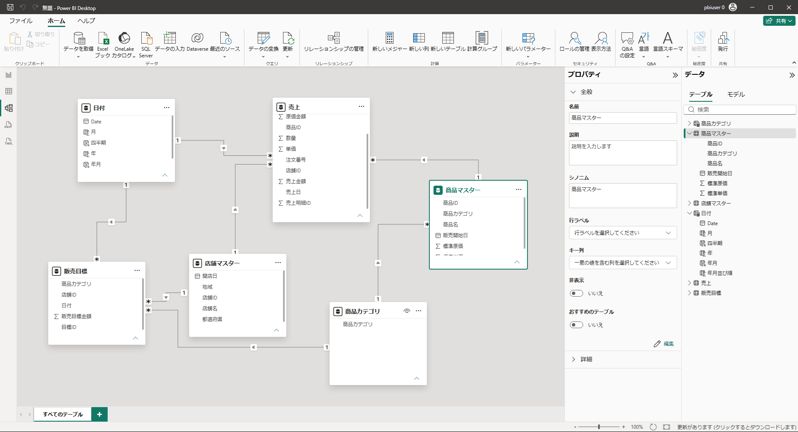

# 演習03 複数データのモデル化とDAX

## 演習概要

12か月分のExcelをフォルダーから結合し、SQL Serverの商品・店舗マスターとSharePointリストの販売目標を追加します。利用できない接続はExcelフォールバックへ切り替えます。粒度の異なるデータを関連付け、計算列とDAXメジャーを作成します。

## 到達目標

- 同じ列構成の複数Excelをフォルダー結合できる
- SQL ServerとSharePoint Onlineリストへ接続できる
- 一対多・単方向のリレーションシップを作成できる
- 日付、店舗、商品の階層をモデルに作成できる
- 地理列へデータカテゴリを設定できる
- 計算列とメジャーを作成し、違いを説明できる
- 基本集計、比率、時間インテリジェンスのDAXを使用できる

## 所要時間

45分

## 接続経路

商品・店舗と販売目標は、標準経路またはフォールバックのどちらか一方だけを読み込みます。

| データ | 標準経路 | フォールバック | 完成クエリ | 件数 |
|---|---|---|---|---:|
| 売上明細 | 月別Excelのフォルダー結合 | なし | `売上` | 7,612行 |
| 商品 | SQL Server `dbo.商品マスター` | `商品マスター.xlsx` | `商品マスター` | 24行 |
| 店舗 | SQL Server `dbo.店舗マスター` | `店舗マスター.xlsx` | `店舗マスター` | 12行 |
| 販売目標 | SharePointリスト`販売目標` | `販売目標.xlsx` | `販売目標` | 576行 |

## 完成するモデル

```text
日付（1）────────（*）売上（*）────────（1）商品マスター
  │                    │
  │                    └──────────────（1）店舗マスター
  │                                         │
  └────（*）販売目標（*）───────────────────┘
               │
               └────────────（1）商品カテゴリ
                              │
                              └────（*）商品マスター
```

売上は伝票明細単位、販売目標は月・店舗・商品カテゴリ単位です。粒度が異なるため、売上と販売目標を直接結合しません。

> **実務上の注意**
>
> フォルダー結合では、対象ファイルの形式、列名、列構成をそろえます。
> リレーションシップの1側に置くキー列は一意であることを確認し、表示条件に応じて変化する集計値は原則としてメジャーで定義します。

## 手順

### 1. 12か月分の売上をフォルダー結合する

1. 新しいレポート（空のレポート）を作成し、`PowerBI演習03_モデルとDAX.pbix`として任意のフォルダに保存します。
2. ［ホーム］→［データを取得］をクリックし、［フォルダー］を選択します。
3. `PowerBITraining/Excel/MonthlySales`フォルダーを指定します(C:\PowerBITraining\Excel\MonthlySales)。個別のExcelは選択しません。
4. 一覧に12個の`.xlsx`があることを確認します。
5. ［結合］→［データの結合と変換］を選択します。
6. ［ファイルの結合］画面で、`売上`を選択します。
7. プレビューに`売上明細ID`、`店舗ID`、`商品ID`などがあることを確認して［OK］を選択します。
8. 結合処理が完了したら、最終結果のクエリ名を`MonthlySales` から `売上`へ変更します。
9. `Source.Name`列は、各行の元ファイルを確認できるため残します。

次の型を設定します。

| 列 | データ型 |
|---|---|
| 売上明細ID、数量、単価、売上金額、原価金額 | 整数 |
| 注文番号、店舗ID、商品ID、Source.Name | テキスト |
| 売上日 | 日付 |
| 割引率 | 10進数 |

> **画面確認**
>
> `売上`は7,612行です。`Source.Name`には12個の月別ファイル名が表示されます。

### 2. 商品・店舗マスターを読み込む

#### 標準経路：SQL Server

1. ［新しいソース］→［SQL Serverデータベース］を選択します。
2. サーバーは `localhost` 、データベース`PowerBITraining`を入力します。
3. 接続モードは［インポート］を選択して［OK］をクリックします。
4. ナビゲーターで`商品マスター`と`店舗マスター`を選択します。
5. ［OK］を選択し、クエリ名が`商品マスター`と`店舗マスター`となっていることを確認します。

#### フォールバック：Excel

SQL Serverへ接続できない場合は、次の設定でExcelを2回読み込みます。

| ファイル | ナビゲーターで選ぶテーブル | 完成クエリ | 件数 |
|---|---|---|---:|
| `Fallback/商品マスター.xlsx` | `ProductMasterTable` | `商品マスター` | 24行 |
| `Fallback/店舗マスター.xlsx` | `StoreMasterTable` | `店舗マスター` | 12行 |

共通操作は［新しいソース］→［Excelブック］→ファイル選択→テーブル選択→［データの変換］→クエリ名変更です。

### 3. 販売目標を読み込む

#### 標準経路：SharePointリスト

1. ［新しいソース］→［SharePoint Onlineリスト］または［SharePointリスト］を選択します。
2. サイトURLに `https://ctctedu.sharepoint.com/sites/power-bi-fundamentals` と入力します。
3. Microsoftアカウントでサインインします。アカウント情報はPower BI Desktopでサインインする際に使用したものと同じものを使用します。
4. サインインが完了したら［接続］をクリックして、ナビゲーターで`販売目標`を選択して［OK］をクリックします。
5. 目標ID、年月、店舗ID、商品カテゴリ、販売目標金額 **以外の列** を削除します。
6. クエリ名を`販売目標`とし、`年月`を日付、`販売目標金額`のデータ型を整数へ設定します。

#### フォールバック：Excel

SharePointへ接続できない場合だけ、`Fallback/販売目標.xlsx`の`SalesTargetFallbackTable`を読み込み、クエリ名を`販売目標`とします。`年月`を日付、`販売目標金額`を整数へ設定します。

> **接続結果の確認**

| クエリ | 期待する件数 |
|---|---:|
| 商品マスター | 24行 |
| 店舗マスター | 12行 |
| 販売目標 | 576行 |

標準経路とフォールバックの両方がある場合は重複しています。使用しない方を削除してください。

### 4. クエリを適用する

1. 読み込み対象が`売上`、`商品マスター`、`店舗マスター`、`販売目標`の4クエリであることを確認します。
2. ［ホーム］→［閉じて適用］を選択します。
3. Power BI Desktopへ戻ったら、左側の［モデル ビュー］を選択します。

### 5. 基本リレーションシップを確認する

各テーブルのリレーションシップは自動的に検出されます。同名かつ同一データ型を持つ列が自動的に関係付けられます。

以下の内容となっているかをリボンメニューにある［リレーションシップの管理］から確認します。

> リレーションシップの管理が表示されていない場合は、ビューが切り替わっていない可能性があります。

| 1側テーブル | 1側の列 | 多側テーブル | 多側の列 | カーディナリティ | 方向 | 状態 |
|---|---|---|---|---|---|---|
| 店舗マスター | 店舗ID | 売上 | 店舗ID | 一対多 | 単一 | アクティブ |
| 店舗マスター | 店舗ID | 販売目標 | 店舗ID | 一対多 | 単一 | アクティブ |
| 商品マスター | 商品ID | 売上 | 商品ID | 一対多 | 単一 | アクティブ |

### 6. 日付テーブルを作る

1. リボンメニューにある［計算］セクションから［新しいテーブル］を選択します。
2. 画面上部に表示される数式バーへ次のDAXを入力し、Enterキーで確定します。

```DAX
日付 =
CALENDAR(
    DATE(2025, 7, 1),
    DATE(2026, 6, 30)
)
```

3. `日付`テーブルが追加されたことを確認します。
4. `日付`テーブルを選択し、リボンメニューの［新しい列］をクリックして次の計算列を作成します。

| 計算列名 | DAX式 | 用途 |
|---|---|---|
| 年 | `年 = YEAR('日付'[Date])` | 年単位の表示 |
| 月 | `月 = MONTH('日付'[Date])` | 月番号 |
| 年度 | `年度 = "FY" & YEAR('日付'[Date]) - IF(MONTH('日付'[Date]) < 4, 1)` | 年度区切り |
| 年月 | `年月 = FORMAT('日付'[Date], "yyyy年M月")` | 月単位の表示 |
| 年月並び順 | `年月並び順 = YEAR('日付'[Date]) * 100 + MONTH('日付'[Date])` | 年月の並べ替え |
| 四半期 | 四半期 = <br/>" Q"<br/>    & IF(<br/>        MONTH('日付'[Date]) <= 3,<br/>        4,<br/>        IF(<br/>            MONTH('日付'[Date]) <= 6,<br/>            1,<br/>            IF(<br/>                MONTH('日付'[Date]) <= 9,<br/>                2,<br/>                3<br/>            )<br/>        )<br/>    ) | 四半期表示 |

5. データペインから`年月`列を選択し、プロパティペインの [詳細] を展開して［列で並べ替え］→`年月並び順`を選択します。
6. `日付`テーブルを選択し、［日付テーブルとしてマーク］で日付列に`Date`を指定します。

### 7. 日付の関係を作る

| 1側 | 1側の列 | 多側 | 多側の列 | カーディナリティ | 方向 | アクティブ |
|---|---|---|---|---|---|---|
| 日付 | Date | 売上 | 売上日 | 一対多 | 単一 | オン |
| 日付 | Date | 販売目標 | 日付 | 一対多 | 単一 | オン |

`販売目標[日付]`は各月の1日です。月単位の表示には`日付[年月]`を使用します。

### 8. 商品カテゴリテーブルと関係を作る

リボンメニューから［新しいテーブル］を選択し、次のDAXを入力します。

```DAX
商品カテゴリ =
DISTINCT('商品マスター'[商品カテゴリ])
```

次の関係を作成します。

| 1側 | 1側の列 | 多側 | 多側の列 | カーディナリティ | 方向 | アクティブ |
|---|---|---|---|---|---|---|
| 商品カテゴリ | 商品カテゴリ | 商品マスター | 商品カテゴリ | 一対多 | 双方向 | オン |
| 商品カテゴリ | 商品カテゴリ | 販売目標 | 商品カテゴリ | 一対多 | 単一 | オン |



### 11. レポートで使用する階層を作る

階層は、関連する複数の列を決められた順序でまとめたモデル上の項目です。演習04では、ここで作る階層をマトリクスへまとめて配置します。

#### 日付階層を作る

1. 右側の［データ］ペインで`日付`テーブルを展開します。

2. 最上位になる`年`を右クリックし、［階層の作成］を選択します。

3. 作成された階層を右クリックして［名前の変更］を選択し、`日付階層`と入力します。

4. `四半期`を`日付階層`へドラッグします。

5. 同じ方法で`年月`、`Date`の順に追加します。

6. 階層を展開し、`年`→`四半期`→`年月`→`Date`の順になっていることを確認します。

7. 順序が違う場合は、階層をクリックしてプロパティ内に表示される階層フィールドをドラッグして並べ替えます。

   > プロパティで階層を並び替えた場合は必ず [レベルの変更を適用します] をクリックしてください

#### 店舗階層を作る

1. `店舗マスター`テーブルの`地域`を右クリックし、［階層の作成］を選択します。
2. 階層名を`店舗階層`へ変更します。
3. `都道府県`、`店舗名`の順に階層へドラッグします。
4. `地域`→`都道府県`→`店舗名`の順になっていることを確認します。

#### 商品階層を作る

1. `商品マスター`テーブルの`商品カテゴリ`を右クリックし、［階層の作成］を選択します。
2. 階層名を`商品階層`へ変更します。
3. `商品名`を階層へドラッグします。
4. `商品カテゴリ`→`商品名`の順になっていることを確認します。

> **画面確認**
>
> 階層には複数段のアイコンが表示されます。元の`年`や`地域`などの列も削除されず、階層とは別に残ります。

### 12. 都道府県を地理データとして分類する

1. `店舗マスター`テーブルの`都道府県`列を選択します。

   > 階層内の都道府県ではなく、テーブル直下の都道府県を選択する必要があります

2. プロパティの［データ型］が［テキスト］であることを確認します。

3. プロパティの［詳細］を展開し、［データ カテゴリ］から［州または都道府県］を選択します。

   > この分類は、地名をAzure Mapsが都道府県として解釈するためのモデル情報です。列の文字列自体は変更しません。

### 13. 計算列を作る

1. `売上`テーブルを選択して［新しい列］を作成します。
3. 次のDAXを入力し、Enterキーで確定します。

```DAX
値引額 =
'売上'[数量] * '売上'[単価] - '売上'[売上金額]
```

4. `値引額`のプロパティでデータ型を整数、桁区切りをオンにします。
5. `売上`テーブルに列アイコン付きの`値引額`が追加されたことを確認します。

計算列は行ごとに計算され、値をモデルに保持します。行単位の分類や計算に向きます。

### 14. 最初のメジャーを作る

1. `売上`テーブルを選択して［新しいメジャー］を選択します。
3. 次のDAXを入力し、Enterキーで確定します。

```DAX
売上合計 = SUM('売上'[売上金額])
```

4. プロパティで整数を選択し、桁区切りをオンにします。
5. `売上`テーブルに電卓アイコン付きの`売上合計`が追加されたことを確認します。

メジャーはビジュアルの表示条件に応じて計算されます。値そのものを各行に保持しません。

### 15. 必須メジャーを完成させる

次の共通操作で表を上から順に作成します。

1. ［作成先］のテーブルを選択します。
2. ［新しいメジャー］を選択し、［DAX］を入力してEnterキーで確定します。
3. ［表示形式］を設定し、電卓アイコンが付いたことを確認します。

| メジャー | 作成先 | DAX | 表示形式 | 学習する内容 |
|---|---|---|---|---|
| 原価合計 | 売上 | `原価合計 = SUM('売上'[原価金額])` | 整数・桁区切り | 基本集計 |
| 粗利益 | 売上 | `粗利益 = [売上合計] - [原価合計]` | 整数・桁区切り | メジャー参照 |
| 粗利率 | 売上 | `粗利率 = DIVIDE([粗利益], [売上合計])` | パーセンテージ形式・小数以下1桁 | 安全な除算 |
| 販売目標合計 | 販売目標 | `販売目標合計 = SUM('販売目標'[販売目標金額])` | 整数・桁区切り | 別テーブルの集計 |
| 目標達成率 | 売上 | `目標達成率 = DIVIDE([売上合計], [販売目標合計])` | パーセントテージ形式・小数1桁 | 複数テーブルの比較 |
| 前月売上 | 売上 | `前月売上 = CALCULATE([売上合計], DATEADD('日付'[Date], -1, MONTH))` | 整数・桁区切り | タイムインテリジェンス |

必須メジャーは、詳細に作成した`売上合計`を含めて7個です。

### 16. フィルターコンテキストを確認する

1. レポートビューでテーブルビジュアルを作成します。
2. `日付[年月]`、`売上合計`、`販売目標合計`、`目標達成率`を配置します。
3. 年月ごとにメジャーの値が変化することを確認します。
4. `店舗マスター[店舗名]`を追加し、同じ年月でも店舗ごとに値が変化することを確認します。
5. 合計行で、売上合計が136,615,781円、目標達成率が約97.3%であることを確認します。
6. Ctrl+SでPBIXを保存します。

年月や店舗名が現在のフィルターコンテキストです。同じメジャーでも、表示条件に応じて結果が変わります。

## 完了条件

- `売上`は7,612行、`商品マスター`は24行、`店舗マスター`は12行、`販売目標`は576行
- 日付と商品カテゴリを含む6テーブルがある
- 関係が一対多・単方向で、曖昧な多対多関係がない
- 1つの計算列と7個の必須メジャーを作成している
- 総売上は136,615,781円、目標達成率は約97.3%
- `PowerBI演習03_モデルとDAX.pbix`を保存している

## よくあるエラーと復旧

### フォルダー結合に一時ファイルが含まれる

Excelを閉じ、`MonthlySales`フォルダーを月別12ファイルだけにします。`~$`から始まるファイルは対象に含めません。

### リレーションシップが多対多になる

1側として選んだ商品ID、店舗ID、日付に重複がないか確認します。販売目標の店舗IDは重複するため、販売目標を1側にはしません。

### 販売目標や目標達成率が空白または全行同じになる

日付、店舗、商品カテゴリから販売目標への関係がアクティブか確認します。フィルター方向をむやみに双方向へ変更しないでください。

### DAXを入力しても作成されない

Enterキーで確定したか確認します。数式バーの赤い表示を確認し、テーブル名、列名、括弧、引用符を資料の式と比較します。

### メジャーを別のテーブルへ作成した

計算結果は変わりませんが、後で探しにくくなります。正しいテーブルへ同じ式で作り直してから、誤ったメジャーを削除します。

## 発展課題：補助メジャーを作る

時間に余裕がある場合は、手順13と同じ共通操作で次の3つを作成します。

| メジャー | 作成先 | DAX | 表示形式 | 用途 |
|---|---|---|---|---|
| 注文件数 | 売上 | `注文件数 = DISTINCTCOUNT('売上'[注文番号])` | 整数 | 注文番号の重複を除いた件数 |
| 平均購入単価 | 売上 | `平均購入単価 = DIVIDE([売上合計], [注文件数])` | 整数・桁区切り | 1注文あたりの売上 |
| 前月差 | 売上 | `前月差 = [売上合計] - [前月売上]` | 整数・桁区切り | 前月からの増減 |

`売上合計`と`前月売上`を月別折れ線グラフへ配置し、季節変動も確認します。

## 次の演習への引継ぎ

このモデルと7個の必須メジャーを使い、演習04で2ページの業務レポートを作成します。

[演習04へ進む](04-report-visualization.md)
