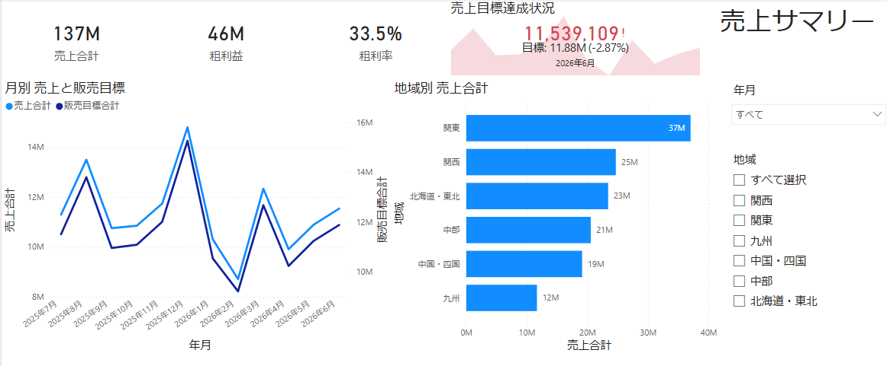
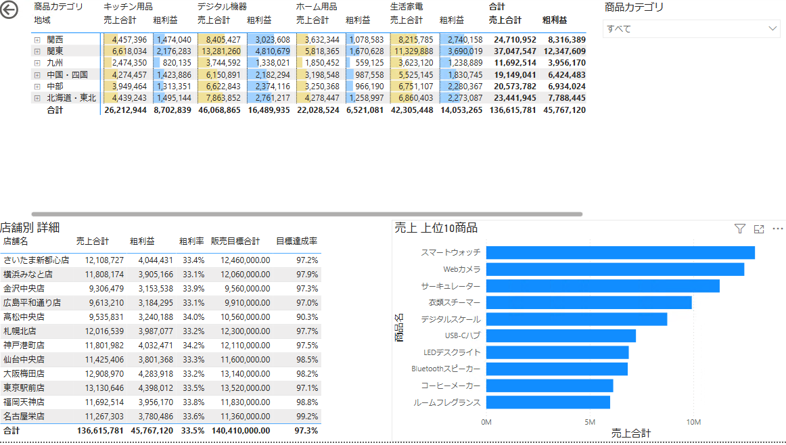
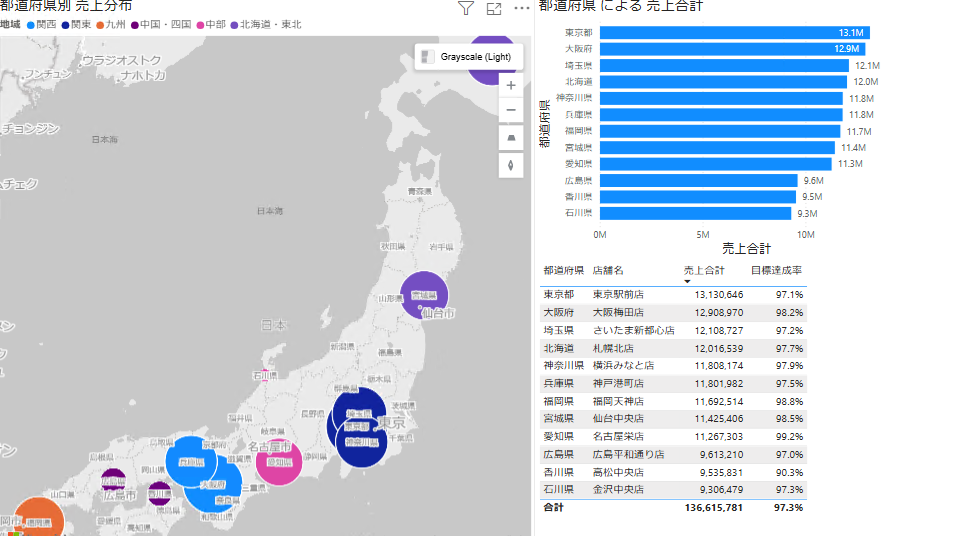
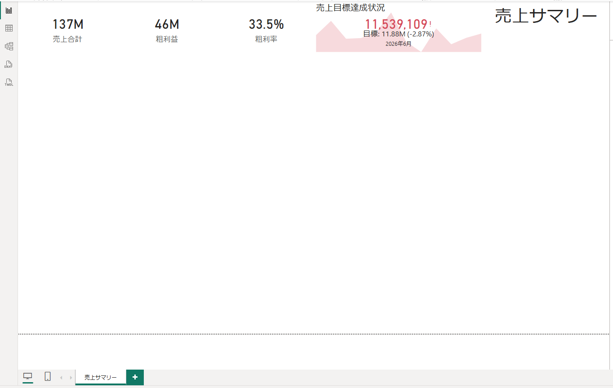
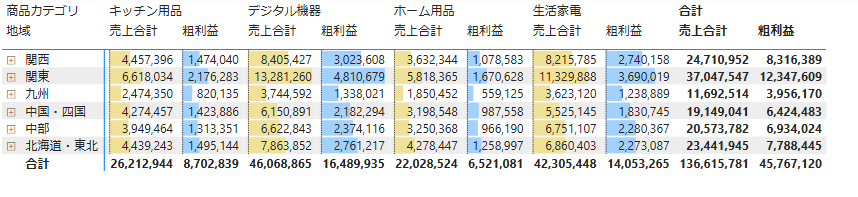
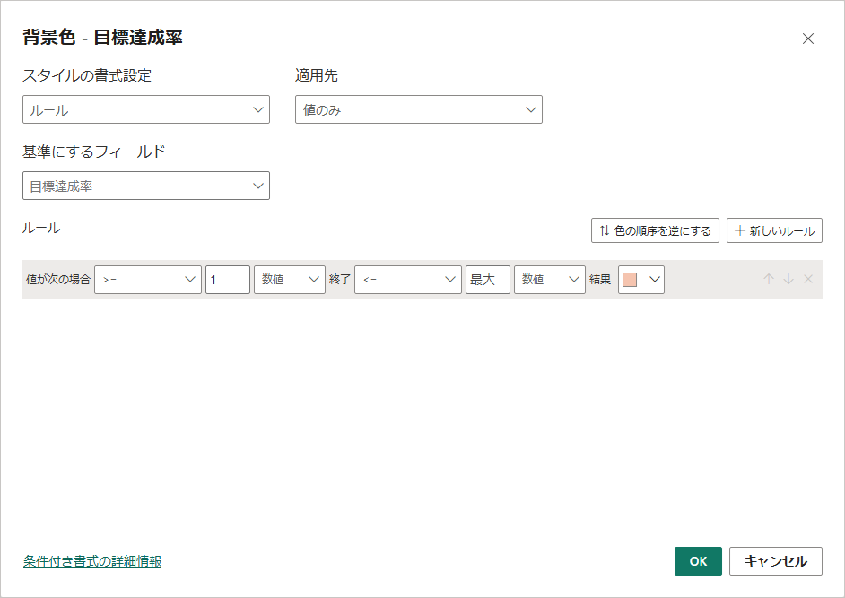
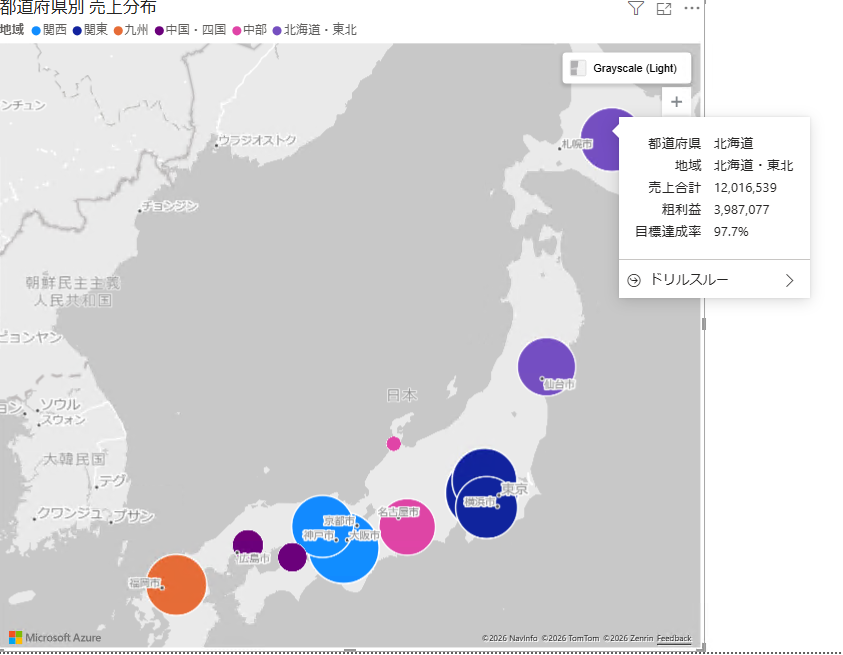

# 演習04 レポートの可視化

## 演習概要

演習03で完成させたモデルを使い、「全体を把握する」「店舗と商品を詳しく見る」「地域的な分布を確認する」という分析の流れに沿って3ページのレポートを作成します。カード、KPI、グラフ、表、マトリクス、スライサー、Azure Mapsを使い分け、ページ間でも同じ絞り込み条件を引き継げるようにします。

## 到達目標

- 目的に応じてカード、KPI、グラフ、表、マトリクスを選択できる
- モデルに作成した階層をビジュアルへ配置し、ドリル操作を確認できる
- 上位Nと条件付き書式を設定できる
- 年月と地域のスライサーを複数ページで同期できる
- Azure Mapsで都道府県別の売上を表示できる
- 地図から詳細ページへドリルスルーできる
- ビジュアル間とページ間の連携を確認できる

## 所要時間

45分

## 作成する3ページ

### ページ1「売上サマリー」

### ページ2「店舗・商品分析」

### ページ3「地域マップ」

> **実務上の注意**
>
> カードは現在値を大きく示す用途、KPIは目標とトレンドを合わせて評価する用途に向きます。
> 地図では所在地情報が外部の地図サービスで処理される場合があるため、組織のデータ利用方針とテナント設定を確認します。

## ビジュアル作成の共通操作

1. キャンバスの白い場所を選択し、既存のビジュアルが選択されていない状態にします。
2. ［視覚化］ペインでビジュアルの種類を選択します。
3. ［データ］ペインから、表に示す配置先へフィールドまたはメジャーをドラッグします。
4. ［ビジュアルの書式設定］でタイトル、表示単位、小数点以下の桁数を設定します。
5. ビジュアルの外枠をドラッグし、設計図を目安に大きさと位置を整えます。

## 手順

### 1. PBIXと1ページ目を準備する

1. `PowerBI演習03_モデルとDAX.pbix`を開きます。
2. ［ファイル］→［名前を付けて保存］を選択します。
3. ファイル名を`PowerBI演習04_完成レポート.pbix`として保存します。
4. 演習03の確認用テーブルビジュアルを選択し、Deleteキーで削除します。
5. 画面下部のページタブをダブルクリックし、ページ名を`売上サマリー`へ変更します。
6. ［挿入］→［テキスト ボックス］を選択し、`売上サマリー`と入力して画面右上に配置します。

### 2. 3枚のカードを作る

1. キャンバスの白い場所を選択します。

2. ［視覚化］ペインで［カード］を選択します。複数の値をまとめるカードではなく、1つの値を表示するカードを使用します。

   > 最初の演習で使用したものと同じ、稲妻アイコンがついていないカードビジュアルを使用します。

3. ［データ］ペインで`売上`テーブルを展開します。

4. 電卓アイコンが付いた`売上合計`メジャーのチェックボックスをクリックします。

5. ビジュアルの書式設定にて［吹き出しの値］から表示単位を［百万］、小数点以下を0桁にします。

6. カードをページ上段の左側へ配置します。

7. カードを選択したままCtrl+C、Ctrl+Vを2回実行します。

8. コピーした2枚を右方向へ並べます。

9. 2枚目では視覚化ペインのフィールドから`売上合計`を［×］で取り除き、`粗利益`を配置します。表示単位を［百万］、小数点以下を0桁になっていることを確認します。

10. 3枚目では`売上合計`を取り除き、`粗利率`を配置します。表示単位を［なし］に変更してパーセント表示になることを確認し、小数点以下を1桁にします。

> **画面確認**
>
> フィルターなしでは、売上は約137百万円、粗利益は約46百万円、粗利率は約33.5%です。

### 3. KPIビジュアルを作る

KPIビジュアルは、トレンド軸の最後の時点を現在値として評価します。並び順を確定してからKPIへ変換します。

1. キャンバスの白い場所を選択し、［集合縦棒グラフ］を追加します。
2. `日付[年月]`を［X軸］へ配置します。
3. `売上[売上合計]`を［Y軸］へ配置します。
4. グラフ右上の［…］を選択し、［軸の並べ替え］または［並べ替え］で`年月`を選びます。
5. もう一度［…］を選択し、［昇順で並び替え］にします。左から2025年7月、右端が2026年6月になることを確認します。
6. グラフを選択したまま、［視覚化］ペインの［KPI］アイコン（上向きと下向きの三角が描かれたアイコン）を選択します。
7. 変換後の配置を次の表と照合します。配置が外れた場合は、表を見ながらドラッグし直します。

| KPIの配置先 | フィールド |
|---|---|
| 値 | `売上[売上合計]` |
| トレンド軸 | `日付[年月]` |
| ターゲット、目標 | `販売目標[販売目標合計]` |

8. ［ビジュアルの書式設定］の［全般］でタイトルを`売上達成状況`とします。
9. 同じく書式設定の［ビジュアル］→［トレンド軸］をオン、方向を［高いと良好］になっていることを確認します。
10. ［ターゲットラベル］と［日付］をオンにします。
11. KPIをカードの右側へ配置します。

> **画面確認**
>
> KPIに2026年6月の売上、同月の販売目標、目標との差、背景の推移が表示されます。目標が空白の場合は、`年月開始日`と`販売目標合計`の配置を確認します。

### 4. ページ1のグラフを作る

共通操作と次の表を使って、2つのグラフを追加します。

| ビジュアル | フィールド配置 | タイトル | 主な設定 | 配置 |
|---|---|---|---|---|
| 折れ線グラフ | X軸: `日付[年月]` / Y軸: `売上合計`、`販売目標合計` | 月別 売上と販売目標 | 年月の昇順。 | 中央左 |
| 集合横棒グラフ | Y軸: `店舗マスター[地域]` / X軸: `売上合計` | 地域別 売上金額 | 売上合計の降順。データラベルをオン | 中央右 |

1. 折れ線グラフの右上にある［…］から、`年月`の［昇順］になっていることを確認します。
2. 地域別棒グラフの［…］から、`売上合計`の［降順］になっていることを確認します。
3. 凡例、軸ラベル、タイトルが途中で切れていないことを確認します。

### 5. ページ1へ共通スライサーを作る

1. ［スライサー］を追加します。
2. `日付[年月]`をスライサーの［フィールド］へ配置します。
3. タイトルを`年月`とします。
4. ビジュアルの書式設定で［スライサーの設定］→［オプション］でスタイルを［ドロップダウン］に変更します。
5. もう1つスライサーを追加し、`店舗マスター[地域]`を配置します。
6. タイトルを`地域`とし、表示を［バーティカルリスト］にします。［選択項目］も展開し、［［すべて選択］オプションを表示する］をオンにします。
7. 2つのスライサーを右端へ配置します。
8. 年月と地域を1つずつ選択し、カード、KPI、折れ線、棒グラフが変化することを確認します。
9. 各スライサーの［選択解除］（消しゴムアイコン）を選択し、フィルターなしへ戻します。

### 6. ビジュアルの相互作用を確認する

1. 地域別棒グラフの任意の棒を選択します。

2. カード、KPI、折れ線がフィルターまたは強調表示されることを確認します。

3. 地域別棒グラフの選択されている棒をもう一度クリックして表示を戻し、上部のリボンメニューから［書式］→［相互作用を編集］を選択します。

4. 他のビジュアル上に、フィルター、強調表示、なしのアイコンが表示されることを確認します。

   > ビジュアルの種類によっては項目が2つもしくは表示されない場合があります

5. 設定は変更せず、もう一度［相互作用の編集］を選択して終了します。

6. 棒グラフの外側を選択して選択状態を解除します。

ここで確認しているのは、同じページにあるビジュアル間の動作です。ページをまたぐスライサーの同期は、3ページを作成した後で設定します。

### 7. 2ページ目を準備する

1. 画面下部の［+］を選択し、新しいページを追加します。
2. ページ名を`店舗・商品分析`へ変更します。
3. テキストボックスで、ページ上部に`店舗・商品分析`と入力します。

### 8. 店舗・商品の階層マトリクスを作る

1. キャンバスの白い場所を選択し、［マトリクス］を追加します。
2. ［データ］ペインで`店舗マスター`テーブルを展開します。
3. 複数段の階層アイコンが付いた`店舗階層`自体を、マトリクスの［行］へドラッグします。階層内の列を1つずつではなく、階層そのものを使用します。
4. `商品マスター`テーブルの`商品階層`全体を［列］へドラッグします。
5. `売上[売上合計]`と`売上[粗利益]`を［値］へ配置します。
6. タイトルを`店舗・商品別 売上`とします。
7. マトリクスをページ左上へ大きく配置し、地域が折りたたまれた状態ですべての行列が見える状態にします。

#### 階層を操作する

1. マトリクスビジュアルのエッジ部分に表示される階層操作アイコンへマウスポインターを合わせ、ツールヒントを確認します。
2. ［階層内で1レベル下をすべて展開します］（下矢印が分岐しているもの）を選択し、地域の下に都道府県が表示されることを確認します。
3. もう一度同じ操作を行い、都道府県の下に店舗名が表示されることを確認します。
4. ［ドリルアップ］（↑アイコン）をクリックすると階層が上位に移動し、［次のレベルに移動］（↓↓アイコン）を選択した場合は、親レベルを残さず次のレベルだけが表示されることを確認します。
5. ［ドリルモード］（↓アイコン）をオンにした場合は、任意の項目を選択するとその項目の下位だけが表示されることを確認します。
6. 確認後は［ドリルアップ］を使い、地域と商品カテゴリが見える状態へ戻します。

#### データバーを設定する

1. ［値］にある`売上合計`のメニュー（下向きの三角）を開きます。
2. ［条件付き書式］→［データ バー］を選択します。
3. ［基準にするフィールド］が`売上合計`であることを確認します。
4. 正の値の色を薄い黄色にして［OK］を選択します。
5. 同様に`粗利益`に対しても条件付き書式を設定し、正の値の色を薄い青色にします。

### 9. 上位10商品と店舗詳細表を作る

#### 上位10商品

1. ［集合横棒グラフ］を追加します。
2. `商品マスター[商品名]`を［Y軸］へ配置します。
3. `売上[売上合計]`を［X軸］へ配置します。
4. タイトルを`売上 上位10商品`とし、ページ右上へ配置します。
5. ［フィルター］ペインの［このビジュアルのフィルター］で`商品名`を展開します。
6. ［フィルターの種類］を［上位N］へ変更します。
7. ［項目の表示］で［上］を選択し、件数に`10`を入力します。
8. ［値］へドロップダウンリストから`売上合計`を選択し、［フィルターを適用］をクリックします。
9. グラフの［…］から`売上合計`の［降順］を選択し、10商品だけが表示されることを確認します。

#### 店舗詳細表

1. ［テーブル］を追加します。
2. テーブルのに対して次の順でフィールドとメジャーを配置します。

| 順序 | フィールドまたはメジャー |
|---:|---|
| 1 | `店舗マスター[店舗名]` |
| 2 | `売上[売上合計]` |
| 3 | `売上[粗利益]` |
| 4 | `売上[粗利率]` |
| 5 | `販売目標[販売目標合計]` |
| 6 | `売上[目標達成率]` |

3. タイトルをオンにして`店舗別 詳細`とし、ページ右下へ配置します。

4. `売上合計`の列見出しを選択し、降順に並べます。

5. フィールド欄で`目標達成率`のメニューを開き、［条件付き書式］→［背景色］を選択します。

6. ［スタイルの書式設定］を［ルール］、［基準にするフィールド］を`目標達成率`にします。

7. 値が`1`以上の場合に目立つ色になるルールを以下の画面のように設定します。内部値の1が100%です。

   

8. ［OK］を選択し、100%以上のセルに色がつく設定が完了しました。現時点ではどこにも色がつかないはずです。

### 10. ページ2のローカルスライサーを作る

1. ［スライサー］を追加します。
2. `商品マスター[商品カテゴリ]`を配置します。
3. タイトルを`商品カテゴリ`、表示を［ドロップダウン］にします。
4. 任意のカテゴリを選択し、マトリクス、上位10商品、店舗詳細表が変化することを確認します。先ほどの`目標達成率`への条件付き書式も作動するはずです。
5. ［選択のクリア］を選択します。

> このスライサーは商品分析ページだけで使用します。後で設定するページ間同期の対象にはしません。

### 11. ページ2をドリルスルー先に設定する

1. キャンバスの白い場所を選択し、どのビジュアルも選択されていない状態にします。
2. ［視覚化］ペインにある［ドリルスルー］領域を探します。
3. `店舗マスター[都道府県]`を、［ドリルスルー フィールドをここに追加します］へドラッグします。
4. キャンバスへ戻るボタンが画面左上に自動的に追加されたことを確認します。
5. 戻るボタンが他のビジュアルと重ならないよう調整します。

>  ドリルスルー先の設定だけでは、このページの表示は変わりません。演習後半で地図上の都道府県から遷移して動作を確認します。

### 12. 3ページ目を準備する

1. 画面下部の［+］を選択し、新しいページを追加します。
2. ページ名を`地域マップ`へ変更します。

### 13. Azure Mapsで売上分布を表示する

1. キャンバスの白い場所を選択します。
2. ［視覚化］ペインで［Azure Maps］（大きい青い矢印アイコン）を選択します。
3. 利用にはサインインが必要となります。サインアウトしてしまっている場合は再度サインインします。
4. 次の表に従ってフィールドを配置します。

| Azure Mapsの配置先 | フィールドまたはメジャー |
|---|---|
| 場所 | `店舗マスター[都道府県]` |
| 凡例 | `店舗マスター[地域]` |
| サイズ | `売上[売上合計]` |
| ヒント | `売上[粗利益]`、`売上[目標達成率]` |

5. ［ビジュアルの書式設定］で［マーカー レイヤー］をオンにします。すでにマーカーが表示されている場合も、設定の場所を確認します。
6. タイトルを`都道府県別 売上分布`とします。
7. 地図をページ左側へ大きく配置します。
8. スライサーで何も選択していない状態で、北海道から福岡県まで12個の都道府県が日本国内に表示されることを確認します。
9. 任意のマーカーへマウスポインターを合わせ、都道府県、地域、売上合計、粗利益、目標達成率が表示されることを確認します。

### 14. 地図を補うグラフと表を作る

地図は分布の把握に向きますが、近い値を正確に比較する場合は棒グラフや表も使用します。

| ビジュアル | フィールド配置 | タイトル | 主な設定 | 配置 |
|---|---|---|---|---|
| 集合横棒グラフ | Y軸: `店舗マスター[都道府県]` / X軸: `売上合計` | 都道府県別 売上 | 売上合計の降順。データラベルをオン | 右上 |
| テーブル | `都道府県`、`店舗名`、`売上合計`、`目標達成率` | 店舗別 指標 | 売上合計の降順 | 右下 |

1. 棒グラフの都道府県数が12件であることを確認します。
2. 地図の任意のマーカーを選択し、棒グラフと表がフィルターまたは強調表示されることを確認します。
3. 地図の外側を選択し、選択状態を解除します。

### 15. 年月と地域のスライサーを3ページで同期する

同期スライサーを使用すると、あるページで選択した年月や地域を、別のページでも同じ条件として使用できます。

#### 年月スライサーを同期する

1. `売上サマリー`ページへ戻ります。
2. 年月スライサーを選択します。
3. 上部のリボンメニューから［表示］→［スライサーの同期］を選択します。
4. 右側に［スライサーの同期］ペインが表示されたことを確認します。
5. ペインには`売上サマリー`、`店舗・商品分析`、`地域マップ`の3行が表示されます。
6. 3ページすべてで［同期］（矢印が円になっているアイコンの列）をオンにします。
7. 3ページすべてで［表示］（目のアイコンの列）もオンにします。
8. `店舗・商品分析`ページを開き、年月スライサーが表示されていることを確認して、商品カテゴリのスライサーの横へ移動します。
9. `地域マップ`ページでも同じように位置を整えます。

#### 地域スライサーを同期する

1. `売上サマリー`ページへ戻り、地域スライサーを選択します。
2. ［スライサーの同期］ペインで、3ページすべての［同期］と［表示］をオンにします。
3. ページ2とページ3でスライサーが表示されていることを確認し、年月スライサーの近くへ配置します。
4. ページ2の`商品カテゴリ`スライサーを選択します。
5. 商品カテゴリは`店舗・商品分析`だけに表示され、ほかのページでは［同期］と［表示］がオフであることを確認します。

### 16. 同期スライサーの動作を確認する

1. `売上サマリー`ページで、年月に`2026年6月`、地域に任意の1地域を選択します。
2. カード、KPI、折れ線、地域別棒が選択条件に変化することを確認します。
3. `店舗・商品分析`ページへ移動します。
4. 年月と地域のスライサーに同じ値が表示され、マトリクス、上位10商品、店舗詳細表が同じ条件に絞られていることを確認します。
5. `地域マップ`ページへ移動します。
6. 地図、都道府県別棒、店舗別表が同じ年月と地域に絞られていることを確認します。
7. `地域マップ`ページで両スライサーの［選択のクリア］を選択します。
8. ページ1とページ2へ移動し、選択が解除されていることを確認します。

### 17. 地図から詳細ページへドリルスルーする

1. `地域マップ`ページで、任意の都道府県のマーカーを右クリックします。マーカーを選びにくい場合は、右側の都道府県別棒グラフの棒を右クリックします。
2. 表示されたメニューで［ドリルスルー］を選択します。
3. 移動先として［店舗・商品分析］を選択します。
4. `店舗・商品分析`ページへ移動し、選択した都道府県の店舗だけがマトリクスと表に表示されることを確認します。
5. 左上の戻るボタンをCtrlキーを押しながら選択します。Power BI Serviceでは通常のクリックで操作します。
6. `地域マップ`ページへ戻ることを確認します。

同期スライサーは年月と地域の共通条件を保ち、ドリルスルーは選択した都道府県を一時的に詳細ページへ渡します。この2つは役割が異なります。

### 18. 3ページのレイアウトを仕上げる

1. ページ1で3枚のカードをShiftキーで複数選択し、リボンメニューの［書式］→［配置］から［上揃え］と［左右に整列］を使用します。
2. KPIをカードと同じ高さにそろえます。
3. ページ2とページ3も含め、ビジュアルの重なり、タイトルの切れ、軸ラベルの読みやすさを確認します。
4. 同じ指標には同じ色を使い、売上、目標、達成状況の色をページ間で統一します。
5. 同期した年月・地域スライサーは、3ページで位置と大きさをそろえます。
6. Ctrl+SでPBIXを保存します。

## 完了条件

- `売上サマリー`、`店舗・商品分析`、`地域マップ`の3ページがある
- ページ1に3枚のカード、KPIビジュアル、折れ線、地域別棒、2つの共通スライサーがある
- KPIの値、トレンド軸、ターゲットへ正しいフィールドを配置している
- ページ2のマトリクスで`店舗階層`と`商品階層`を使用している
- 上位N、データバー、背景色の条件付き書式を設定している
- ページ3にAzure Maps、都道府県別棒、店舗別表がある
- 年月と地域のスライサーが3ページで同期し、商品カテゴリはページ2だけで動作する
- 都道府県から`店舗・商品分析`へドリルスルーできる
- タイトル、単位、並び順、色、余白が整っている
- `PowerBI演習04_完成レポート.pbix`を保存している

## よくあるエラーと復旧

### KPIの目標または日付が空白になる

KPIのトレンド軸が`日付[年月]`、ターゲットが`販売目標合計`であることを確認します。`売上[売上日]`や`日付[Date]`をトレンド軸にすると、最新日と月初日単位の目標が一致しません。

### KPIが古い月を現在値として表示する

KPIへ変換する前のグラフで、`年月開始日`を昇順にします。KPIへ変換した後に並べ替えを選べない場合は、いったん縦棒グラフへ戻し、昇順にしてから再度KPIへ変換します。

### 年月が文字順で並ぶ

`日付[年月]`を選び、［列で並べ替え］が`年月並び順`になっているか確認します。

### マトリクスに階層操作アイコンが表示されない

個別の`地域`や`店舗名`ではなく、複数段のアイコンが付いた`店舗階層`全体を［行］へ配置します。商品側も`商品階層`全体を［列］へ配置します。

### 販売目標が空白になる

日付、店舗、商品カテゴリから販売目標への関係を確認します。目標比較には日付テーブルのフィールドを使用します。

### 上位Nを設定しても10件にならない

`商品名`のフィルターが［上位N］、件数が`10`、［値別］が`売上合計`であることを確認し、［フィルターの適用］を選択します。

### スライサーの選択が別ページへ反映されない

対象の年月または地域スライサーを選択し、［スライサーの同期］ペインで3ページの［同期］がオンか確認します。［表示］はスライサーを画面に出す設定、［同期］は選択状態を共有する設定です。

### ドリルスルーのメニューに詳細ページが表示されない

`店舗・商品分析`ページのドリルスルーフィールドが`店舗マスター[都道府県]`であることを確認します。移動元も、同じ`都道府県`列を使った地図マーカーまたは棒を右クリックします。

## 追加課題

演習03の発展課題で`注文件数`と`平均購入単価`を作成した場合は、商品別棒グラフとAzure Mapsのツールヒントへ追加します。データ点へマウスを置き、補足値が表示されることを確認します。

## 次の演習への引継ぎ

完成した`PowerBI演習04_完成レポート.pbix`を演習05でPower BI Serviceへ発行し、3ページ、同期スライサー、Azure Maps、ドリルスルーの動作をブラウザーでも確認します。

[演習05へ進む](05-sharing-with-power-bi-service.md)
